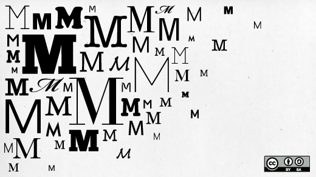

=================
RST_Reference
=================

This file provides basic examples of RST formatting.

* This is a bulleted list.
* It has two items, the second
  item uses two lines.

1. This is a numbered list.
2. It has two items too.

Another type of list:

#. This is a numbered list.
#. It has two items too.

This is a normal text paragraph. The next paragraph is a code sample::

   It is not processed in any way, except
   that the indentation is removed.

   It can span multiple lines.

This is a normal text paragraph again.

For example, here we add an M code example

   LABEL1 ; example
    READ "What is your name ?",!,YOURNAME
    WRITE "Hello ",YOURNAME,!
    QUIT

and now we explain what this code does.

Here is a table

+------------------------+------------+----------+----------+
| Header row, column 1   | Header 2   | Header 3 | Header 4 |
| (header rows optional) |            |          |          |
+========================+============+==========+==========+
| body row 1, column 1   | column 2   | column 3 | column 4 |
+------------------------+------------+----------+----------+
| body row 2             | ...        | ...      |          |
+------------------------+------------+----------+----------+

Here is a simpler table

=====  =====  =======
A      B      A and B
=====  =====  =======
False  False  False
True   False  False
False  True   False
True   True   True
=====  =====  =======

Here is how to add links

This is a paragraph that contains `a link`_.

.. _a link: http://opensource.com/

Here is the return to the `RPI Course`_

.. _RPI Course: http://www.opensourcesoftwarepractice.org

Here is documentation on how to use `RST Markup`_

.. _RST Markup: http://sphinx.pocoo.org/rest.html#rst-primer

Here is how to insert an image:

Put images in the "M-Tutorial/images" subdirectory.
Make sure that they are in the Public Domain, or that they can be distributed
under a Creative Commons by Attribution license. (do not use images under the
Non-Commercial license).

Lorem ipsum [#f1]_ dolor sit amet ... [#f2]_

.. rubric:: Footnotes

.. [#f1] Text of the first footnote.
.. [#f2] Text of the second footnote.
